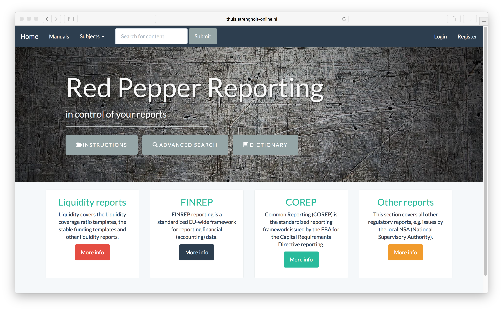

RED PEPPER REPORTING FRAMEWORK
=======
Copyright (c) 2017 Piethein Strengholt, piethein@strengholt-online.nl

Red Pepper Reporting Framework is an easy to use management solution to easily maintain and document regulatory, management and disclosure reports.
Red Pepper Reporting Framework features a lightweight fluid responsive design. It is written in PHP/Laravel + jQuery / HTML / CSS (Bootstrap).

REQUIREMENTS
------------
* PHP >= 5.5.9
* OpenSSL PHP Extension
* Mbstring PHP Extension
* Tokenizer PHP Extension
* Composer
* Git

INITIAL DEPLOYMENT
------------
* install composer: `curl -sS https://getcomposer.org/installer | php — –filename=composer`
* ssh to the machine, go the www directory
* clone the repository: `git clone https://github.com/pietheinstrengholt/redpepper.git .`
* run `composer install --no-dev --optimize-autoloader` , use your github key when asked.
* copy the `.env.example` to `.env` and configure with the correct database settings. If localhost doesn't work, try 127.0.0.1 instead.
* run `php artisan key:generate` to generate an unique key. Add this key to the .env configuration file
* deploy the database, use the following command: `php artisan migrate:install`
* run `php artisan optimize`
* run `php artisan route:optimize`
* run `php artisan cache:clear`
* run `chmod -R 777 storage/`
* run `composer dump-autoload`
* in case the apache user needs rights, use `chown apache:apache * -R`

UPDATING
------------
* run `php artisan down`
* run `git pull` - to save your credentials permanently using the following: `git config credential.helper store`
* run `composer install`
* run `php artisan migrate`
* run `php artisan config:clear`
* run `php artisan cache:clear`
* run `php artisan route:cache` - issue: https://laracasts.com/discuss/channels/laravel/why-unable-to-prepare-route-for-serialization-uses-closure
* run `chown www-data:www-data * -R`
* run `chown www-data:www-data .env -R`
* run `chown www-data:www-data public/.htaccess -R`
* run `chmod -R 777 storage/`
* run `php artisan up`

TODO
------------
* Cleanup ChangeRequestController, clone object instead of line by line copy
* Cleanup views, move all css to app.css, add media responsive
* Add more efficient way to lookup reference value
* Change and compare of template changes
* Remove fields such as template process_and_organisation_description, etc.
* jQuery 3.0?
* rename fields to be consistent; shortdesc, visible
* Helper bim - create hyperlink with id by looking up, instead of name
